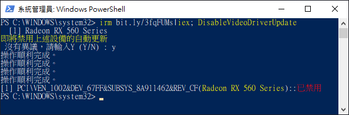
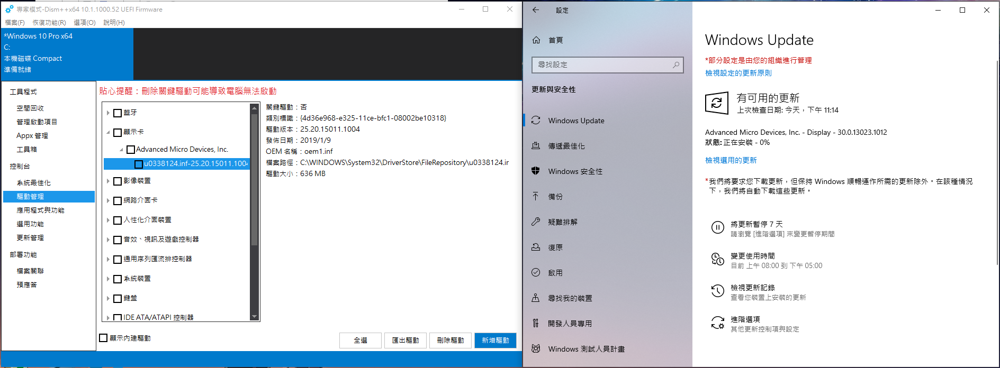
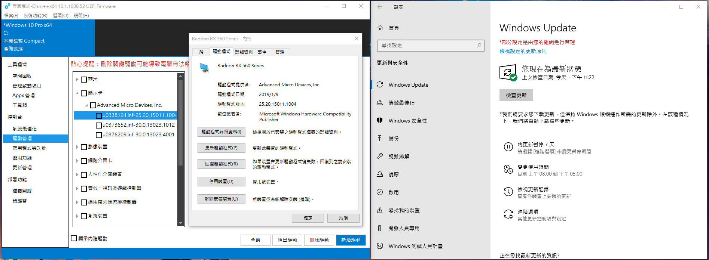

禁用 NVIDIA or AMD 顯示卡驅動的自動更新
===



## 指令說明

按下 Win+X 再按 A 打開終端機  

```ps1
# 禁用顯示卡驅動自動更新
irm bit.ly/DisAMDUpdate|iex; DisableVideoDriverUpdate

# 禁用AMD顯示卡驅動更新
irm bit.ly/DisAMDUpdate|iex; DisAMD
irm bit.ly/DisAMDUpdate|iex; DisableVideoDriverUpdate -Filter:Radeon

# 恢復所有設備的自動更新
irm bit.ly/DisAMDUpdate|iex; RcvAMD
irm bit.ly/DisAMDUpdate|iex; DisableVideoDriverUpdate -Recovery

# 查看設備
irm bit.ly/DisAMDUpdate|iex; DisableVideoDriverUpdate -Info
```

修改完畢再去更新會跳錯，AMD的驅動就不會被更新了。  


<br><br><br>

## 捷徑代碼

禁用
```ps1
powershell -nop -c "irm bit.ly/DisAMDUpdate|iex; DisAMD"
```

復原
```ps1
powershell -nop -c "irm bit.ly/DisAMDUpdate|iex; RcvAMD"
```


<br><br><br>

## 實際運作狀況
大致的測試結果在這軟這邊會推送兩個版本的更新。  


第一個版本會跟自動更新一樣權限相當不會經過你的同意就會自動更新。如果有設定手動更新可以擋住，但是當你想做安全性更新的時候無法選擇會一起更新。  
<br>
第二個版本會比較新會出現在選用更新裡面，這個就算你設定自動更新也可以自己選擇要不要更，基本上不會煩到人，主要是第一個版本會擅自更新。  

<br><br>


指令執行完畢之後會更不上去，像這樣的更新失敗圖。只是驅動版本沒套上去而已，實際上是已經載到系統裡面了，可以從應用程式看到版本增加了。  

<br><br>


接著繼續把選用更新也一併跑完  

<br><br>


結果是一樣的，出現錯誤並且又增加了第三個版本  

<br><br>


兩個版本都跑完之後就不會再來煩你了，更新不會再次出現顯示卡的更新。不過電腦上倒是增加了兩個版本的驅動。這些版本不能砍掉，刪除之後更新會再次跳出來把驅動版本載回來。  